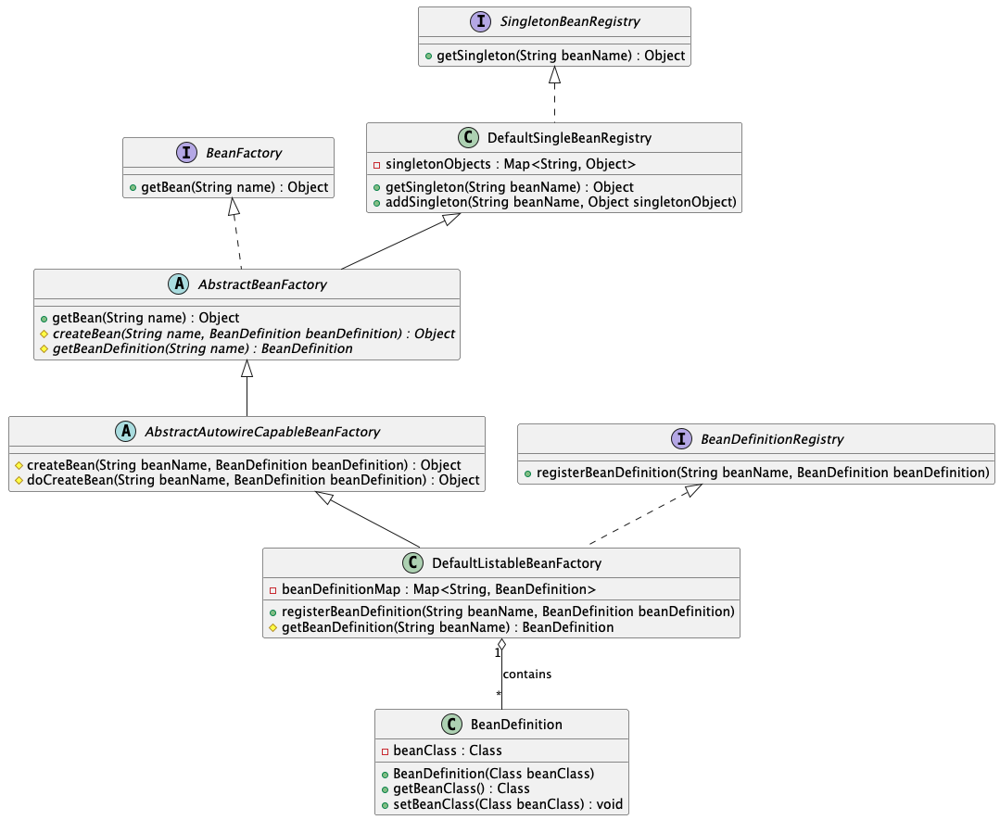
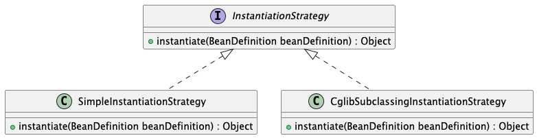

# IOC
## 最简单的bean容器
> 分支：simple-bean-container

定义一个简单的bean容器BeanFactory，内部包含一个map用以保存bean，只有注册bean和获取bean两个方法
```
public class BeanFactory {
	private Map<String, Object> beanMap = new HashMap<>();

	public void registerBean(String name, Object bean) {
		beanMap.put(name, bean);
	}

	public Object getBean(String name) {
		return beanMap.get(name);
	}
}
```
测试：BeanFactoryTest
```
@Test
public void testGetBean() throws Exception {
    BeanFactory beanFactory = new BeanFactory();
    beanFactory.registerBean("helloService", new HelloService());

    HelloService helloService = (HelloService) beanFactory.getBean("helloService");
    assertThat(helloService).isNotNull();
    assertThat(helloService.sayHello()).isEqualTo("hello");
}

class HelloService {
    public String sayHello() {
        System.out.println("hello");
        return "hello";
    }
}
```

## BeanDefinition和BeanDefinitionRegistry
> 分支：step-02-bean-definition-and-bean-definition-registry

主要增加如下类：
- BeanDefinition，用于定义bean信息的类，包含bean的class类型、作用域（单例/原型）、懒加载标记、依赖的属性列表、初始化/销毁方法名等信息。每个bean对应一个BeanDefinition的实例，相当于创建bean的图纸，让框架不需要在运行时频繁使用开销较大的反射去解析类结构，而是提前缓存好类的蓝图，实现Bean的定义与创建解耦。简化BeanDefition仅包含bean的class类型。
- BeanDefinitionRegistry，BeanDefinition注册表接口，定义注册BeanDefintion的方法。
- SingletonBeanRegistry及其实现类DefaultSingletonBeanRegistry，定义添加和获取单例bean的方法。

bean容器作为BeanDefinitionRegistry和SingletonBeanRegistry的实现类，具备两者的能力。向bean容器中注册BeanDefintion后，使用bean时才会实例化。



测试：
```
public class BeanDefinitionAndBeanDefinitionRegistryTest {

	@Test
	public void testBeanFactory() throws Exception {
		DefaultListableBeanFactory beanFactory = new DefaultListableBeanFactory();
		BeanDefinition beanDefinition = new BeanDefinition(HelloService.class);
		beanFactory.registerBeanDefinition("helloService", beanDefinition);

		HelloService helloService = (HelloService) beanFactory.getBean("helloService");
		helloService.sayHello();
	}
}

class HelloService {
	public String sayHello() {
		System.out.println("hello");
	}
}
```
## Bean实例化策略InstantiationStrategy
> 分支：instantiation-strategy

现在bean是在AbstractAutowireCapableBeanFactory.doCreateBean方法中用beanClass.newInstance()来实例化，仅适用于bean有无参构造函数的情况。



针对bean的实例化，抽象出一个实例化策略的接口InstantiationStrategy，有两个实现类：
- SimpleInstantiationStrategy，使用bean的构造函数来实例化
- CglibSubclassingInstantiationStrategy，使用CGLIB动态生成子类，再通过子类实例化

## 为bean填充属性
> 代码分支：step-04-populate-bean-with-property-values

在BeanDefinition中增加和bean属性对应的PropertyValues，实例化bean之后，为bean填充属性(AbstractAutowireCapableBeanFactory#applyPropertyValues)。

测试：
```java
public class PopulateBeanWithPropertyValuesTest {

    @Test
    public void testPopulateBeanWithPropertyValues() throws Exception {
        // 创建容器
        DefaultListableBeanFactory beanFactory = new DefaultListableBeanFactory();
        // 构造bean的属性信息
        PropertyValues propertyValues = new PropertyValues();
        propertyValues.addPropertyValue(new PropertyValue("name", "jack"));
        propertyValues.addPropertyValue(new PropertyValue("age", 20));
        // 构造bean的图纸
        BeanDefinition beanDefinition = new BeanDefinition(Person.class, propertyValues);
        // 注册bean的图纸
        beanFactory.registerBeanDefinition("person", beanDefinition);

        // 获取bean
        Person person = (Person) beanFactory.getBean("person");
        System.out.println(person);
        assertThat(person.getName()).isEqualTo("jack");
        assertThat(person.getAge()).isEqualTo(20);
    }
}
```


